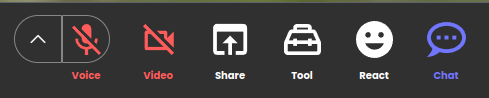
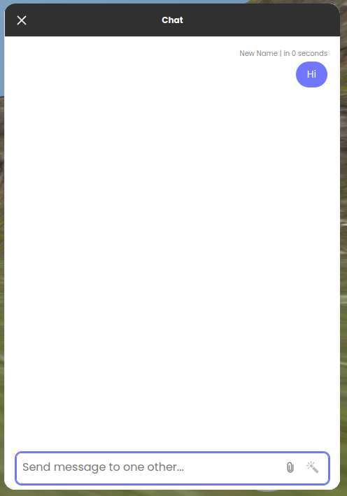

# CustomChatButton template

## Description

This is a template for creating a CustomChatButton for `metatell`.

`metatell` has a built-in chat feature that allows users to chat with each other. The chat feature is implemented as a modal that can be toggled by clicking on a chat button.

Default chat button looks like this:
Chat button is located at the most right side of the toolbar.

<p align="center">
  
</p>

When the chat button is clicked, the chat modal is displayed:
Default chat modal looks like this:

<p align="center">
  
</p>

You can replace the default chat button and modal with a custom chat button and modal by creating a CustomChatButton.

## Pre-requisites

- Node.js 20 (We recommend using volta to manage node versions)

## npm scripts

- `npm run dev`: Start the development server
- `npm run build`: Build the project
- `npm run test`: Run unit tests
- `npm run lint`: Run all lint check
- `npm run lint:tsc`: Run code check based on tsc
- `npm run lint:prettier`: Run code check based on prettier
- `npm run lint:eslint`: Run code check based on eslint
- `npm run lint-fix`: Run all code fix
- `npm run lint-fix:prettier`: Run code fix based on prettier
- `npm run lint-fix:eslint`: Run code fix based on eslint

## Interfaces

The CustomChatButton should implement the following interface:

```ts
type MessageGroup = {
  id: number;
  type:
    | "chat"
    | "join"
    | "entered"
    | "leave"
    | "display_name_changed"
    | "hub_name_changed";
  timestamp: number;
  sender?: string;
  senderSessionId?: string;
  messages?: {
    id: number;
    body: string;
    timestamp: number;
  }[];
  name?: string;
  hubName?: string;
  oldName?: string;
  newName?: string;
};

interface CustomChatButtonProps {
  toggleDefaultModal: () => void;
  sendMessage: (message: string) => void;
  messageGroups: MessageGroup[];
}
```

- `toggleDefaultModal`: A function that toggles the default chat modal.
- `sendMessage`: A function that sends a message to the chat.
- `messageGroups`: An array of message groups. A message group is an object that contains information about a group of messages. The message group object has the following properties:
  - `id`: A unique identifier for the message group.
  - `type`: The type of the message group. The type can be one of the following:
    - `chat`: A chat message.
    - `join`: A room join notification message.
    - `entered`: An access URL notification message.
    - `leave`: A leave message.
    - `display_name_changed`: A display name changed message.
    - `hub_name_changed`: A hub name changed message.
  - `timestamp`: The timestamp of the message group.
  - `sender`: The sender of the message group. **This property is only present for `chat` type messages.**
  - `senderSessionId`: The sender session ID of the message group. **This property is only present for `chat` type messages.**
  - `messages`: An array of messages. **This property is only present for `chat` type messages.** Each message object has the following properties:
    - `id`: A unique identifier for the message.
    - `body`: The body of the message.
    - `timestamp`: The timestamp of the message.
  - `name`: The display name of the actor. **This property is only present for `join`, `entered`, `leave`, and `hub_name_changed` type messages.**
  - `hubName`: The new room name. **This property is only present for `hub_name_changed` type messages.**
  - `oldName`: The old display name of the actor. **This property is only present for `display_name_changed` type messages.**
  - `newName`: The new display name of the actor. **This property is only present for `display_name_changed` type messages.**

## How to develop

1. Install dependencies

install the dependencies by running the following command:

```
npm install
```

2. Run the development server

Run the following command to start the development server:

the development server will start at http://localhost:3004

```
npm run dev
```

3. update package.json to add metadata

Update the package.json file to add metadata about the CustomChatButton. The metadata includes the name, description, and the version of plugin.

You can update the following fields to the package.json file:

```json
{
  "name": "my-cool-custom-chat-button",
  "version": "0.0.1",
  "description": "A custom chat button"
}
```

4. Build the project

Run the following command to build the project:

```
npm run build
```

You can find the built files in the `dist` directory.

5. Publish the project

You can publish the plugin from `metatell-admin` in future.

## Tips

### Restrictions

- Do not use default export. export Component as named export
- Component name should be `CustomChatButton`
- component should be placed in `src/CustomChatButton` directory
  - You can change the directory to update federation config in `/configs/federationConfig.js`

### Styling

You can use CSS Modules without any additional configuration.

If you want to use different styling systems like styled-components, you can do so by installing the required packages.

