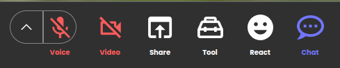
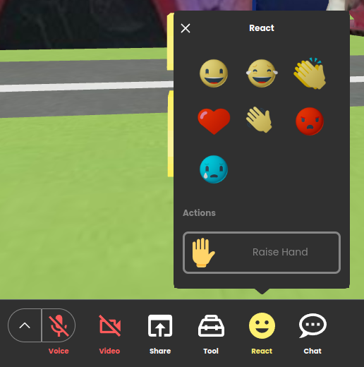
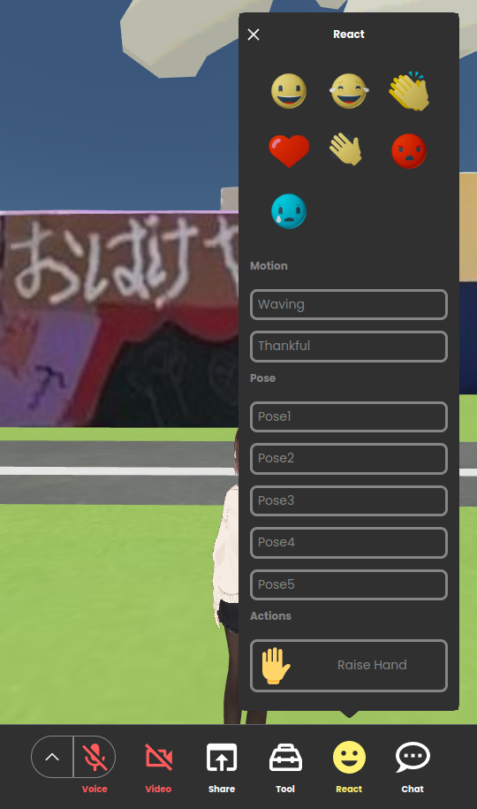

# CustomReactionButton template

## Description

This is a template for creating a CustomReactionButton for `metatell`.

`metatell` has a built-in reaction feature that allows users to react with emojis or animations.

The default reaction button looks like this:
It's the second one from the right in the toolbar.

<p align="center">
  
</p>

When the reaction button is clicked, the popup appears like this:

<p align="center">
  
</p>

When user use VRM avatar, the popup appears like this:

<p align="center">
  
</p>

You can replace the default reaction button and popup with a custom reaction button creating a CustomReactionButton.

## Pre-requisites

- Node.js 20 (We recommend using volta to manage node versions)

## npm scripts

- `npm run dev`: Start the development server
- `npm run build`: Build the project
- `npm run test`: Run unit tests
- `npm run lint`: Run all lint check
- `npm run lint:tsc`: Run code check based on tsc
- `npm run lint:prettier`: Run code check based on prettier
- `npm run lint:eslint`: Run code check based on eslint
- `npm run lint-fix`: Run all code fix
- `npm run lint-fix:prettier`: Run code fix based on prettier
- `npm run lint-fix:eslint`: Run code fix based on eslint

## Interfaces

The CustomReactionButton should implement the following interface:

```ts
interface CustomReactionButtonProps {
  // TODO
}
```

## How to develop

1. Install dependencies

install the dependencies by running the following command:

```
npm install
```

2. Run the development server

Run the following command to start the development server:

the development server will start at http://localhost:3004

```
npm run dev
```

3. update package.json to add metadata

Update the package.json file to add metadata about the CustomChatButton. The metadata includes the name, description, and the version of plugin.

You can update the following fields to the package.json file:

```json
{
  "name": "my-cool-custom-reaction-button",
  "version": "0.0.1",
  "description": "A custom reaction button"
}
```

4. Build the project

Run the following command to build the project:

```
npm run build
```

You can find the built files in the `dist` directory.

5. Publish the project

You can publish the plugin from `metatell-admin` in future.

## Tips

### Restrictions

- do not use default export. export Component as named export
- component name should be `CustomReactionButton`
- component should be placed in `src/CustomReactionButton` directory
  - You can change the directory to update federation config in `/configs/federationConfig.js`

### Styling

You can use CSS Modules without any additional configuration.

If you want to use different styling systems like styled-components, you can do so by installing the required packages.

