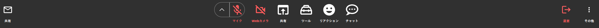
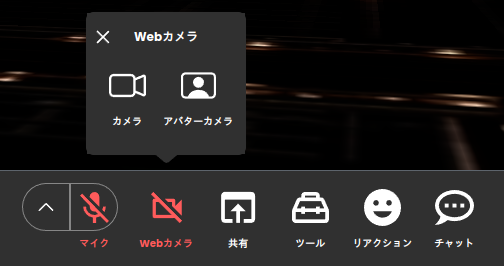

# CustomWebCameraButton template

## Description

This is a template for creating a CustomWebCameraButton for `metatell`.

`metatell` has a built-in web camera button feature that allows users to turn on/off their web camera. The default web camera button looks like this: (the button is located at the second left side of the toolbar)

<p align="center">
  
</p>

If user can share the web camera to the avatar, popup will be shown when user click the button.

<p align="center">
  
</p>

You can replace the default web camera button with a custom one by implementing a CustomWebCameraButton.

## Pre-requisites

- Node.js 20 (We recommend using volta to manage node versions)

## npm scripts

- `npm run dev`: Start the development server
- `npm run build`: Build the project
- `npm run test`: Run unit tests
- `npm run lint`: Run all lint check
- `npm run lint:tsc`: Run code check based on tsc
- `npm run lint:prettier`: Run code check based on prettier
- `npm run lint:eslint`: Run code check based on eslint
- `npm run lint-fix`: Run all code fix
- `npm run lint-fix:prettier`: Run code fix based on prettier
- `npm run lint-fix:eslint`: Run code fix based on eslint

## Interface

The CustomWebCemeraButton should implement the following interface:

```ts
interface CustomWebCameraButtonProps {
  isSharing: boolean;
  canShareCamera: boolean;
  toggleShareCamera: () => void;
  canShareCameraToAvatar: boolean;
  toggleShareCameraToAvatar: () => void;
}
```

- `isSharing`: A boolean value that indicates whether the user is sharing the web camera.
- `canShareCamera`: A boolean value that indicates whether the user can share the web camera.
- `toggleShareCamera`: A function that toggles the web camera sharing.
- `canShareCameraToAvatar`: A boolean value that indicates whether the user can share the web camera to the avatar.
- `toggleShareCameraToAvatar`: A function that toggles the web camera sharing to the avatar.

## How to develop

1. Install dependencies

install the dependencies by running the following command:

```
npm install
```

2. Run the development server

Run the following command to start the development server:

the development server will start at http://localhost:3004

```
npm run dev
```

3. update package.json to add metadata

Update the package.json file to add metadata about the custom leave button. The metadata includes the name, description, and version of the plugin.

You can update the following fields to the package.json file:

```json
{
  "name": "my-cool-custom-web-camera-button",
  "version": "0.0.1",
  "description": "A CustomWebCameraButton"
}
```

4. Build the project

Run the following command to build the project:

```
npm run build
```

You can find the built files in the `dist` directory.

5. Publish the project

You can publish the plugin from `metatell-admin` in future.

## Tips

### Restrictions

- do not use default export. export Component as named export
- component name should be `CustomWebCameraButton`
- component should be placed in `src/CustomWebCameraButton` directory
  - You can change the directory to update federation config in `/configs/federationConfig.js`

### Styling

You can use CSS Modules without any additional configuration.

If you want to use different styling systems like styled-components, you can do so by installing the required packages.

